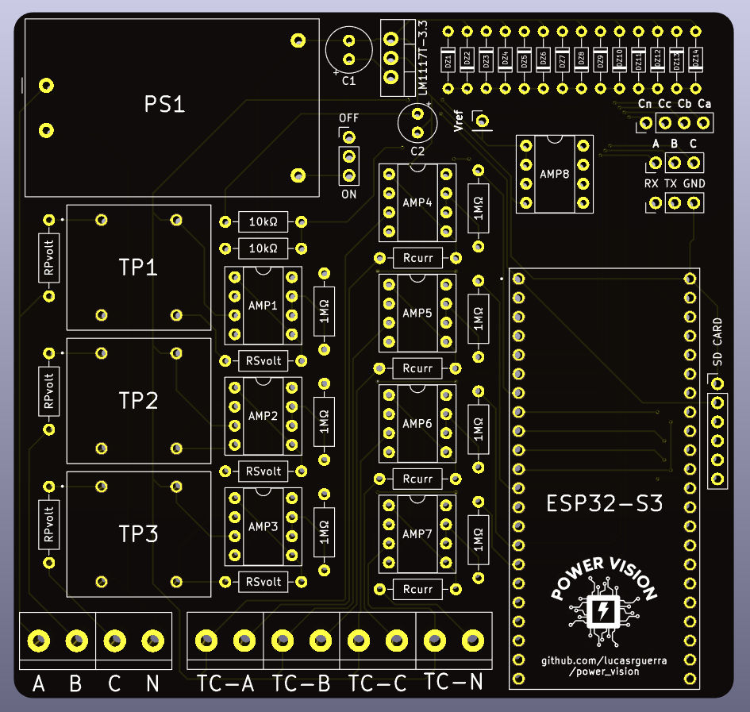
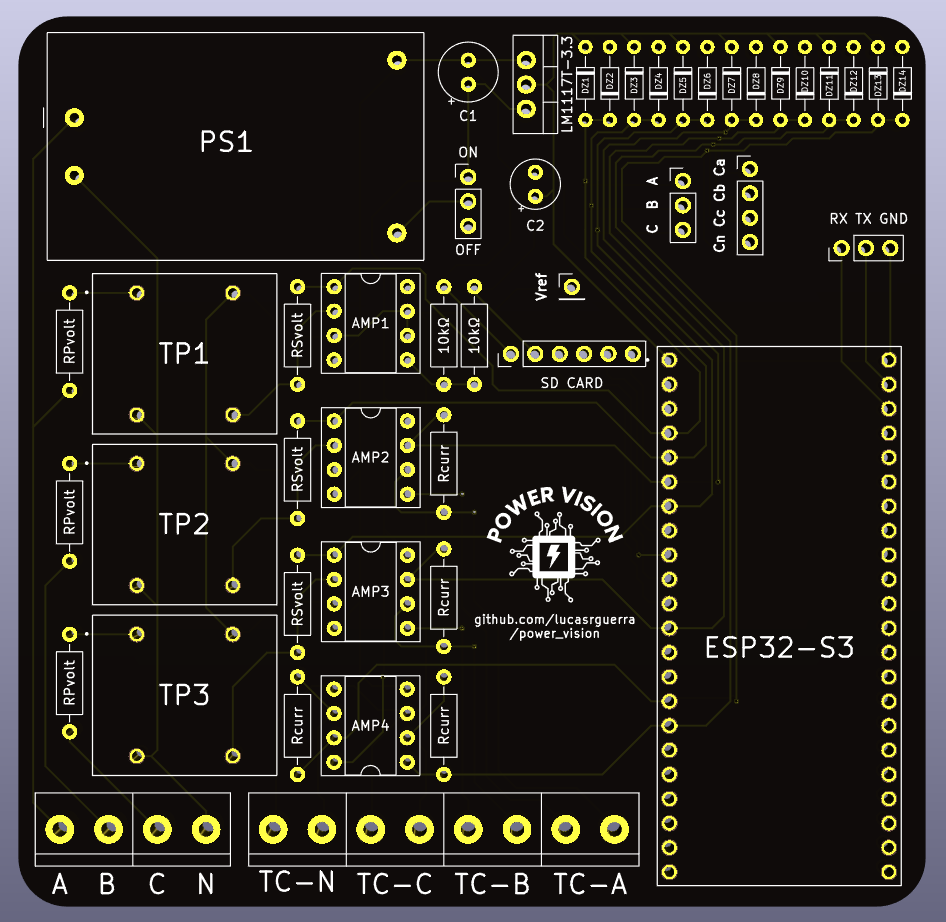
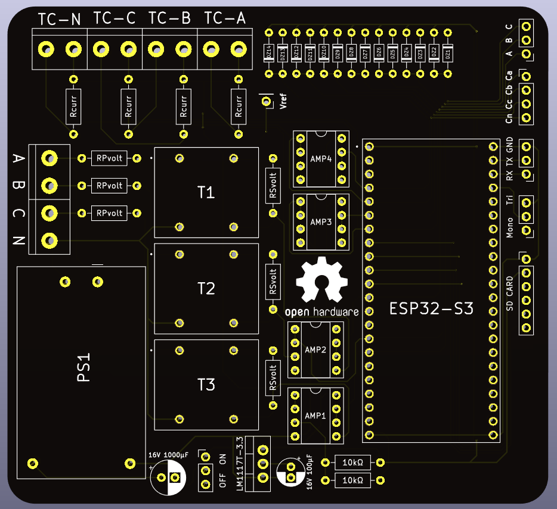
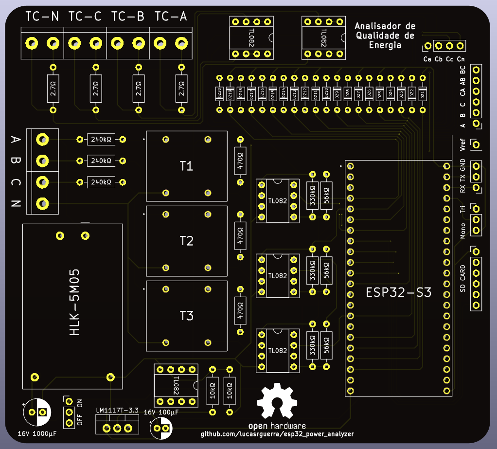
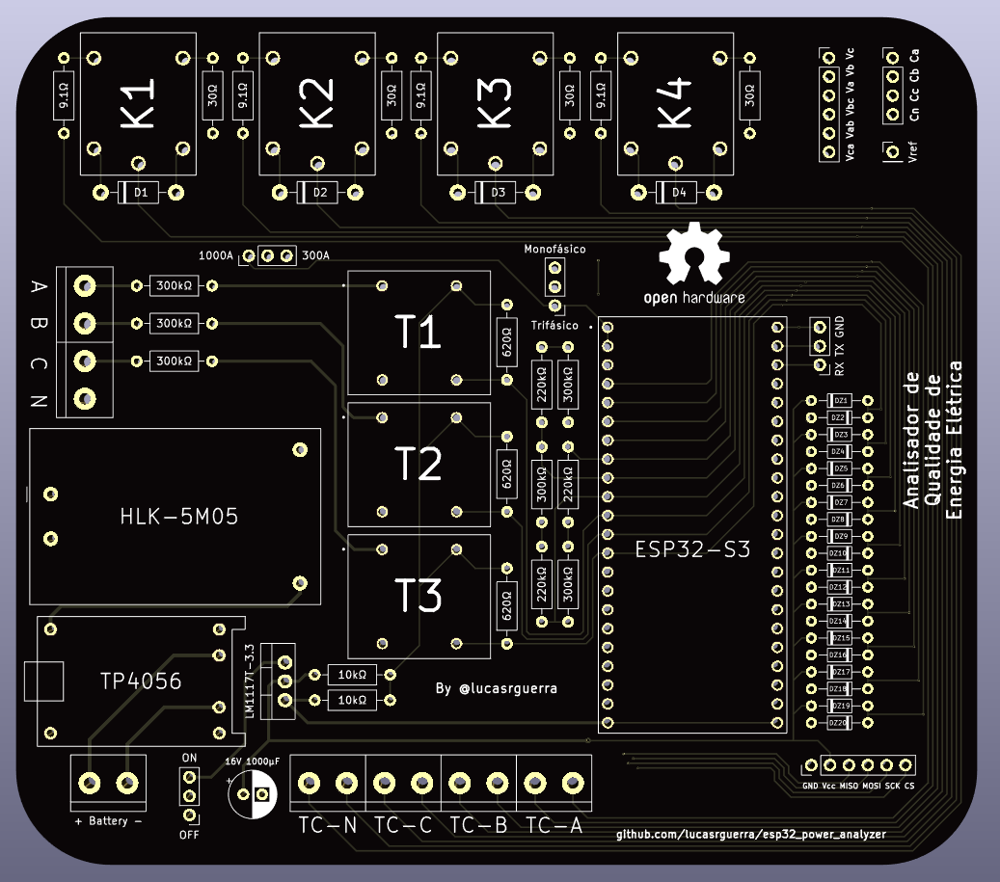
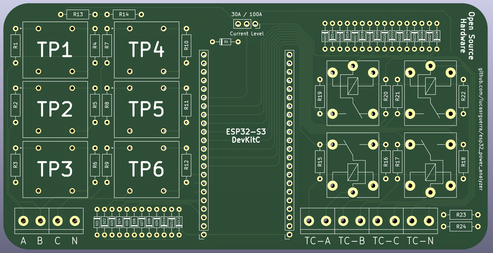
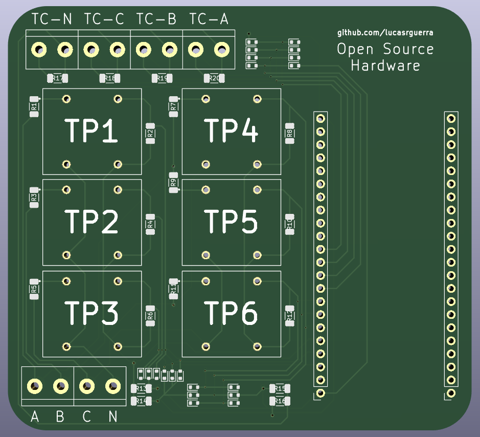
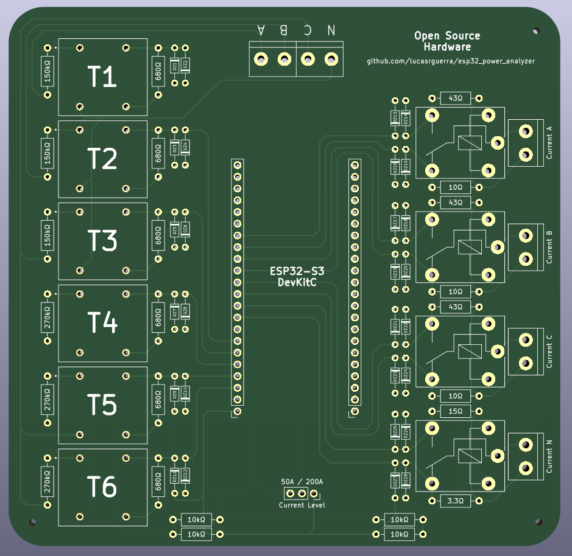

# Placas do projeto

## Descrição

Nesta pasta estão todos os arquivos das placas desenvolvidas para este projeto utilizando o software KiCAD. Dentre esses arquivos, estão o esquemático, o layout da placa e seus arquivos de fabricação no formato Gerber.

## Versões Disponíveis

- **[`v3.3`](./v3.3/)**: Essa é a décima versão da placa e no modelo THT (Through-Hole Technology).
- **[`v3.2`](./v3.2/)**: Essa é a nona versão da placa e no modelo THT (Through-Hole Technology).
- **[`v3.1`](./v3.1/)**: Essa é a oitava versão da placa e no modelo THT (Through-Hole Technology).
- **[`v3.0`](./v3.0/)**: Essa é a sétima versão da placa e no modelo THT (Through-Hole Technology).
- **[`v2.1`](./v2.1/)**: Essa é a sexta versão da placa e no modelo THT (Through-Hole Technology).
- **[`v2.0`](./v2.0/)**: Essa é a quinta versão da placa e no modelo THT (Through-Hole Technology).
- **[`v1.1`](./v1.1/)**: Essa é a quarta versão da placa e no modelo THT (Through-Hole Technology).
- **[`v1.0`](./v1.0/)**: Essa é a terceira versão da placa e no modelo THT (Through-Hole Technology).
- **[`v0.7`](./v0.7/)**: Essa é a segunda versão da placa e no modelo SMT (Surface-Mount Technology).
- **[`v0.5`](./v0.5/)**: Essa é a primeira versão da placa e no modelo THT (Through-Hole Technology).

## Dados das Placas

### Placa v3.3 (THT) - 96,012mm de largura x 91,440mm de altura (Atual)

Essa placa foi desenvolvida mantendo o design compacto e organizado da versão anterior. Ela possui além dos circuitos de transimpedância, os buffers de tensão, garantindo uma maior precisão nas medições. A placa também possui resistores de 1MΩ para aumentar a estabilidade dos buffers de tensão e limitar a corrente que passa pelos diodos zener de proteção.

### Placa v3.2 (THT) - 94,448mm de largura x 92,710mm de altura

Essa placa foi desenvolvida para ser mais compacta e organizada que a anterior. Ela não usa mais os buffers de tensão, que foram substituidos pelo mesmo amplificadores operacionais, mas agora em uma configuração de transimpedância, garantiando uma maior precisão nas medições. A placa também não necessita mais do circuito de seleção do tipo de sistema elétrico, deixando essa opção para o software. Além disso, a placa possui um layout mais compacto e organizado que as anteriores.

### Placa v3.1 (THT) - 99,842mm de largura x 91,948mm de altura

Essa placa foi desenvolvida sem a necessidade da leitura das tensões de linha. Ela possui em seu esquemático as tabelas de resistores para cada nível de tensão e corrente no qual se deseja operar. Vale ressaltar que todos os resistores shunt utilizados foram recalculados para melhorar a precisão das medições e aproveitar melhor a faixa de operação do ADC do ESP32-S3, assim como, todos os sinais agora estão conectados a canais do ADC 1 do ESP32-S3, trazendo uma maior precisão as leituras. Além disso, a placa possui um layout mais compacto que as anteriores.

### Placa v3.0 (THT) - 113,284mm de largura x 98,044mm de altura

Essa placa foi desenvolvida para ser condicionar melhor os sinais de corrente e tensão, utilizando diversos buffers para isso. Ela não possui mais um circuito de seleção de níveis de corrente, operando de acordo com a resistor shunt utilizado. Ela também não possui mais um circuito de gerenciamento de bateria. Vale ressaltar que todos os resistores shunt utilizados foram recalculados para melhorar a precisão das medições e aproveitar melhor a faixa de operação do ADC do ESP32-S3. Além disso, a placa possui um layout mais compacto e organizado que as anteriores.

### Placa v2.1 (THT) - 139,700mm de largura x 116,840mm de altura

Essa placa foi desenvolvida para ser mais compacta e organizada que a anterior. Além disso, ela possui pequenas correções, como a seleção manual do nível de corrente a ser utilizado nas medições e também  a largura de cada trilha da placa, aumentando a largura de trilhas com maior corrente. Nessa placa a cor da placa também foi alterada para preto.

### Placa v2.1 (THT) - 144,780mm de largura x 101,419mm de altura

Essa placa possui um menos transformadores de potencial, mas tem agora um circuito resposável pelo gerenciamento da energia utilizada na placa, com suporte para baterias 18650 de Ion-Lítion, um seleção de níveis de corrente, sendo eles 300A e 1000A, e suporte a módulos de cartão SD. Além disso, a placa possui um layout mais organizado que as anteriores. Além disso, ela possui pequenas correções, como a adição de um diodo retificador para proteção do circuito de seleção de níveis de corrente e a correção do identificador de todos os componentes no Footprint.

### Placa v1.1 (THT) - 143,510mm de largura x 73,025mm de altura

Essa placa possui o mesmo layout da anterior. Porém, foram corrigidos os nomes dos Diodos Zener no Footprint e foi adicionado um Diodo Retificador para proteção do circuito de seleção de níveis de corrente.

### Placa v1.0 (THT) - 143,510mm de largura x 73,025mm de altura

Essa placa possui um layout mais compacto e organizado que as anteriores, além de ter a conexão entre o ESP32-S3 e o módulo de interrupção de níveis de corrente. E os níveis de corrente dessa placa são 30A e 100A, possibilitando uma leiura mais precisa e adequada ao sensor utilizado, especialmente em baixas correntes.

### Placa v0.7 (SMT) - 90,170mm de largura x 82,423mm de altura

Essa placa possui um layout mais compacto e organizado que a primeira versão. Porém, ele não possui a seleção de níveis de corrente, lendo apenas na escala de 100A.

### Placa v0.5 (THT) - 119,380mm de largura x 116,840mm de altura

Essa placa possui um layout menos compacto e organizado. Além disso, ela possui a seleção de níveis de corrente, lendo na escala de 50A e 200A.
